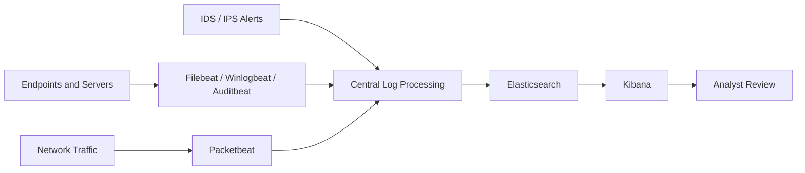

# Monitoring Architecture

## Scenario

The original 350CT coursework described a large enterprise network with multiple server farms, intermediary routing nodes, internet-facing services and several hundred client systems distributed across subnets.

The monitoring design therefore had to balance **visibility** with **storage, processing and operational constraints**.

## Proposed Architecture

> This diagram is a portfolio visualisation of the monitoring approach described in the original report. The coursework proposed the architecture; it was not deployed in production.

## Sensor and Collection Strategy

The strongest design decision in the report was **not collecting the same depth of telemetry everywhere**.

### Critical server areas

The report proposed richer monitoring around the three server farms because they contained sensitive and high-value resources.

- selective full-packet collection
- session data
- statistical traffic data
- IDS / IPS alert data

### Wider network

Across the broader network, the design focused more heavily on session, statistical and alert data to reduce storage and processing overhead.

### During an incident

The report proposed increasing the depth of collection during live investigation so that full-packet data could provide more granular evidence about what an intruder was doing.

## Why This Matters

This approach demonstrates a core monitoring trade-off: **maximum visibility is not always operationally practical**. The original design therefore prioritised richer evidence around critical assets and lighter-weight telemetry elsewhere.